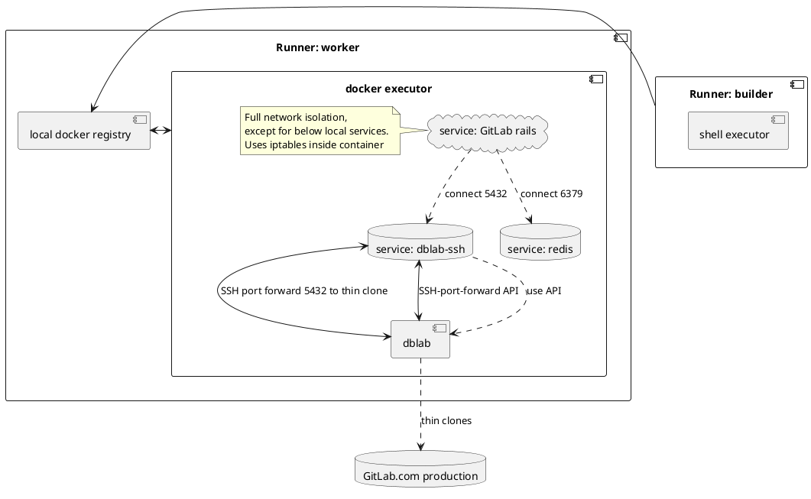
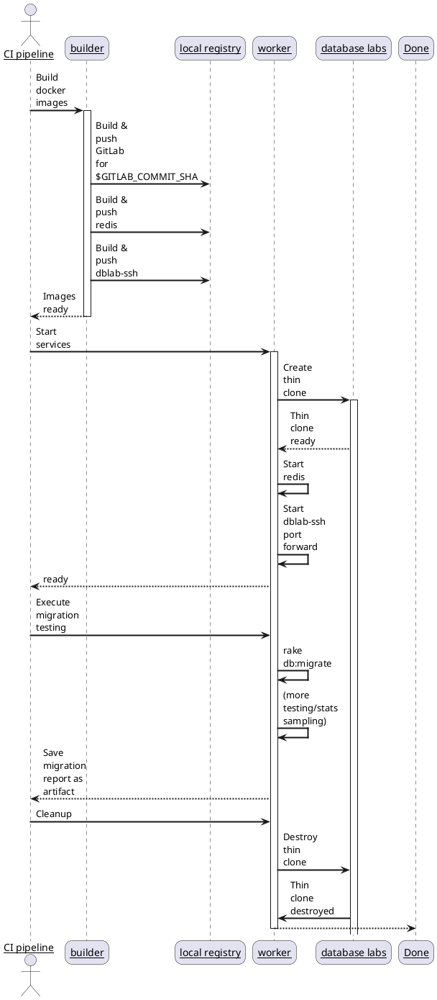

# Automated database migration testing

This project contains automation to test GitLab database migrations on the GitLab.com dataset. This is intended to be used before the migration code is being merged and deployed.

By using thin-clone technology provided by postgres.ai, the dataset used is very close to actual GitLab.com production. This allows us to analyze migrations and their behavior on the actual dataset, before merging code.

For reference, the project is mirrored to the [ops.gitlab.net](https://ops.gitlab.net/gitlab-com/database-team/migration-testing) instance. We execute CI pipelines on this instance only.

## Architecture

### Components

There are a few components involved:

1. `Runner: builder` - This is a GitLab runner building docker images
1. `Runner: worker` - This is a GitLab runner executing application code to test migrations
1. `dblab` - postgres.ai database labs for thin cloning capabilities

Each runner runs on a separate GCP instance. The `worker` runner comes with a fully isolated network (except for ops.gitlab.net - so it can act as a runner, see discussion below). The idea is to separate the process in two phases:

1. Building images - no network isolation necessary
1. Executing migration testing - network isolation necessary



### Sequence

The following shows the sequence of steps from the CI pipeline point of view. The pipeline starts for a particular GitLab SHA (`$GITLAB_COMMIT_SHA`).



### Runner setup


```
curl -L "https://packages.gitlab.com/install/repositories/runner/gitlab-runner/script.deb.sh" | sudo bash

apt-get upgrade
GITLAB_RUNNER_DISABLE_SKEL=true apt-get install gitlab-runner docker.io bundler jq
usermod -aG docker gitlab-runner
ufw allow ssh
ufw allow from 10.128.0.0/24 to any port 5000
ufw enable
```

#### GitLab Runner

1. Register runner (tags - see below): `gitlab-runner register`
1. Restart runner: `service gitlab-runner restart`

#### Docker

1. Add insecure docker registry in `/etc/docker/daemon.json`
```
{
  "insecure-registries" : ["10.128.0.19:5000"]
}
```
1. Reload docker `service docker reload`

#### Worker

* Runner tag: `worker`
* Runner type: `docker`

The worker additionally runs a local docker registry:

1. Run docker registry: `docker run -d -p 5000:5000 --restart=always --name registry registry:2`

The worker needs to allow containers to manage iptables - add this to `/etc/gitlab-runner/config.toml`:

```
[[runners]]
  [runners.docker]
    # ...
    cap_add = ["NET_ADMIN", "NET_RAW"]
```

#### Builder

* Runner tag: `builder`
* Runner type: `shell`


### Security

Both runners run each on their own GCP instance in the `group-database` project:

1. No public interface, only private network 10.128.0.0/9
1. Internet access through Cloud NAT
1. VPC-side firewall
1. Instance-level firewall (UFW)

The instance with the `worker` runner is locked down additionally through the VPC firewall:
1. Disallow egress traffic,
1. except for ops.gitlab.net:443 (for runner communication)
1. except for SSH and DNS.
1. Disallow ingress traffic.

The `GitLab` docker container that runs on the `worker`, additionally employs iptables in the container:
1. Disallow any egress/ingress traffic,
1. except for 172.16.0.0/12 (local docker network)

The `dblab-ssh` docker container provides the postgres `service` to the build job. That is, it
1. port-forwards the dblab API (connects to dblab instance through public network using SSH)
1. after creating a thin clone, it port-forwards the thin clone's Postgres port (connects to dblab instance through public network using SSH)
1. the forwarded Postgres port is bound to all interfaces, hence exposing this as the `service` port

In summary, the `GitLab` container (with the application code) can only connect to the services provided in other containers on the same instance (through `172.16.0.0/12`).
The `dblab-ssh` container connects to database labs and provides the postgres connection.

SSH port-forwarding between `dblab-ssh` and dblabs is set up using key authentication. The key is stored as a CI variable.